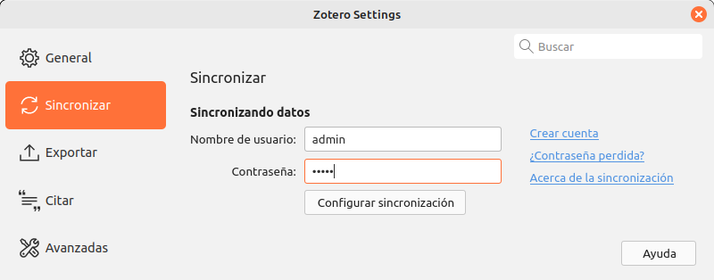

# Dockerized-Zotero

This repository allows you to run the Zotero data server locally using docker containers, and easily build the Zotero client application. It is inspired by [ZotPrime](https://github.com/FiligranHQ/zotprime).

Before use, make sure you have Docker installed. For instructions on how to install Docker Desktop, see: [Install Docker Engine](https://docs.docker.com/engine/install).

## Zotero Server 

### Initial configuration 

- Elasticsearch uses a _mmapfs_ directory by default to store its indices. The default operating system limits on mmap counts is likely to be too low, which may result in out of memory exceptions. On Linux, you can increase the limits by running the following command as root:

    ```bash
    $ sudo sysctl -w vm.max_map_count=262144
    ```

    To set this value permanently, update the _vm.max_map_count_ setting in _/etc/sysctl.conf_:

    ```bash
    $ sudo echo "vm.max_map_count=262144" >> /etc/sysctl.conf
    ```

    More info: [Elasticsearch reference](https://www.elastic.co/guide/en/elasticsearch/reference/current/vm-max-map-count.html#vm-max-map-count)

- Redis service requires to enable the memory overcommit configuration in host machine. Without it, a background save or replication may fail under low memory condition. To fix this issue run the following command as root:
    ```bash
    $ sudo sysctl -w vm.overcommit_memory=1
    ```

    To set this value permanently, add _vm.overcommit_memory = 1_ to _/etc/sysctl.conf_ file:

    ```bash
    $ sudo echo "vm.overcommit_memory=1" >> /etc/sysctl.conf
    ```
    More info: [Redis warning discussion](https://github.com/nextcloud/all-in-one/discussions/1731)


### Run Data Server

Download souce code and configure the server: 
```bash
$ sudo docker compose up -d
```

The source code is downloaded when the docker image is created. When creating a container, a copy of the container will be available in the _/dataserver/dataserver_ folder (a docker volume). To check and download a new version of the dataserver, it is necessary to use the above command with the _--build_ option.

*Available endpoints*:

| Name          | URL                    | Login    | Password      |
| ------------- | ---------------------- |--------- | ------------- |
| Zotero API    | http://localhost:8080  | admin    |  admin        |
| Stream Server | http://localhost:8081  | -        |  -            |
| S3 API        | http://localhost:8082  | -        |  -            |
| PHPMyAdmin    | http://localhost:3000  | root     |  zotero       |
| S3 Web UI     | http://localhost:4000  | zotero   |  zoterodocker |

*Data location*:

| Name            | URL                                           |
| --------------- | --------------------------------------------- |
| MySQL Database  | /mysql/data                                   |
| S3 File Storage | /minio/data                                   |

## Zotero Client 

### Build

Build Zotero Desktop App: 
```bash
$ cd client
$ sudo docker compose up [linux|windows]
```

The build will be placed in the _/client/staging_ folder in unpackaged form. The new files will be copied in this folder after finishing the compilation and closing zotero.

The source code is downloaded when the docker image is created. It is compiled when the container is created. Therefore, to check and download a new version of zotero, it is necessary to use the above command with the _--build_ option to recreate the image and then compile in a new container.

### First usage

*Run*:
```bash
$ ./staging/Zotero_VERSION/zotero(.exe)
```

*Connect with the default user and password*:

| Name          | Login                    | Password           |
| ------------- | ------------------------ | ------------------ |
| Zotero        | admin                    | admin              |

[comment]: 


### Create new user

*Run*:
```bash
$ sudo docker compose exec zotero-dataserver /create-user.sh [ID] [USERNAME] [PASSWORD] [EMAIL]
```

The ID is a unique integer number that Zotero uses internally to identify the user. You can add, edit and delete users with PhpMyAdmin accessing to http://localhost:3000.